<!-- GENERATED: não editar; rodar ci/generate_graph.py -->
# Mapa de relacionamento dos metadados

> Artefato DERIVADO dos metadados reais, não fonte de verdade. Editar aqui é trabalho
> perdido: o `--check` do CI contradiz a edição na hora mais cara.

Legenda: azul-escuro = projeto · azul = capacidade (`CAP-`) · ciano = componente (`CMP-`) ·
roxo = interface (`IFC-`) · verde = regra (`RULE-`) · rosa = superfície de UI (`UI-`) ·
amarelo = ADR · vermelho = risco (`RISK-`).

```mermaid
graph TD
  PROJ_project_squadposlgpd["project-squadposlgpd"]
  MET_COMPARABILIDADE[["MET-COMPARABILIDADE"]]
  MET_CONFORMIDADE[["MET-CONFORMIDADE"]]
  MET_RASTREABILIDADE[["MET-RASTREABILIDADE"]]
  RISK_ALIGN_001["RISK-ALIGN-001"]
  RISK_CHANGE_001["RISK-CHANGE-001"]
  RISK_CHANGE_002["RISK-CHANGE-002"]
  RISK_CONF_001["RISK-CONF-001"]
  RISK_CONF_002["RISK-CONF-002"]
  RISK_DECISION_001["RISK-DECISION-001"]
  RISK_DEP_001["RISK-DEP-001"]
  RISK_DERIV_001["RISK-DERIV-001"]
  RISK_DERIV_002["RISK-DERIV-002"]
  RISK_EXT_001["RISK-EXT-001"]
  RISK_INCUBA_001["RISK-INCUBA-001"]
  RISK_INGEST_001["RISK-INGEST-001"]
  RISK_INGEST_002["RISK-INGEST-002"]
  RISK_META_001["RISK-META-001"]
  RISK_META_002["RISK-META-002"]
  RISK_MOLD_001["RISK-MOLD-001"]
  RISK_ORIENT_001["RISK-ORIENT-001"]
  RISK_PRIV_001["RISK-PRIV-001"]
  RISK_PRIV_002["RISK-PRIV-002"]
  RISK_SEC_001["RISK-SEC-001"]
  RISK_STAGE_001["RISK-STAGE-001"]
  RISK_WEBQA_001["RISK-WEBQA-001"]
  ADR_001["ADR-001"]
  ADR_001 -->|mitiga| RISK_WEBQA_001
  ADR_002["ADR-002"]
  ADR_002 -->|mitiga| RISK_META_001
  ADR_003["ADR-003"]
  ADR_003 -->|mitiga| RISK_DEP_001
  ADR_004["ADR-004"]
  ADR_004 -->|mitiga| RISK_CHANGE_001
  ADR_005["ADR-005"]
  ADR_005 -->|mitiga| RISK_CONF_001
  ADR_006["ADR-006"]
  ADR_006 -->|mitiga| RISK_CONF_001
  ADR_006 -->|mitiga| RISK_STAGE_001
  ADR_007["ADR-007"]
  ADR_007 -->|mitiga| RISK_PRIV_001
  ADR_007 -->|mitiga| RISK_PRIV_002
  ADR_008["ADR-008"]
  ADR_008 -->|mitiga| RISK_DERIV_001
  ADR_008 -->|mitiga| RISK_DERIV_002
  ADR_009["ADR-009"]
  ADR_009 -->|mitiga| RISK_DERIV_002
  ADR_009 -->|mitiga| RISK_INGEST_001
  ADR_010["ADR-010"]
  ADR_010 -->|mitiga| RISK_INGEST_001
  ADR_010 -->|mitiga| RISK_INGEST_002
  ADR_011["ADR-011"]
  ADR_011 -->|mitiga| RISK_ALIGN_001
  ADR_012["ADR-012"]
  ADR_012 -->|mitiga| RISK_CONF_002
  ADR_012 -->|mitiga| RISK_DERIV_001
  ADR_013["ADR-013"]
  ADR_013 -->|mitiga| RISK_DEP_001
  ADR_013 -->|mitiga| RISK_SEC_001
  ADR_014["ADR-014"]
  ADR_014 -->|mitiga| RISK_META_001
  ADR_014 -->|mitiga| RISK_ORIENT_001
  ADR_015["ADR-015"]
  ADR_015 -->|mitiga| RISK_DERIV_001
  ADR_015 -->|mitiga| RISK_MOLD_001
  ADR_016["ADR-016"]
  ADR_016 -->|mitiga| RISK_CHANGE_001
  ADR_016 -->|mitiga| RISK_META_001
  ADR_017["ADR-017"]
  ADR_017 -->|mitiga| RISK_CONF_001
  ADR_017 -->|mitiga| RISK_DECISION_001
  ADR_018["ADR-018"]
  ADR_018 -->|mitiga| RISK_DEP_001
  ADR_018 -->|mitiga| RISK_SEC_001
  ADR_019["ADR-019"]
  ADR_019 -->|mitiga| RISK_CONF_001
  ADR_019 -->|mitiga| RISK_META_001
  ADR_020["ADR-020"]
  ADR_020 -->|mitiga| RISK_EXT_001
  ADR_020 -->|mitiga| RISK_META_002
  ADR_021["ADR-021"]
  ADR_021 -->|mitiga| RISK_META_001
  ADR_021 -->|mitiga| RISK_PRIV_001
  ADR_022["ADR-022"]
  ADR_022 -->|mitiga| RISK_META_001
  ADR_022 -->|mitiga| RISK_ORIENT_001
  ADR_023["ADR-023"]
  ADR_023 -->|mitiga| RISK_DEP_001
  ADR_023 -->|mitiga| RISK_META_001
  ADR_024["ADR-024"]
  ADR_024 -->|mitiga| RISK_CONF_001
  ADR_024 -->|mitiga| RISK_DEP_001
  ADR_025["ADR-025"]
  ADR_025 -->|mitiga| RISK_CONF_001
  ADR_025 -->|mitiga| RISK_EXT_001
  ADR_025 -->|mitiga| RISK_MOLD_001
  ADR_026["ADR-026"]
  ADR_026 -->|mitiga| RISK_CONF_001
  ADR_026 -->|mitiga| RISK_DERIV_002
  ADR_026 -->|mitiga| RISK_MOLD_001
  ADR_027["ADR-027"]
  ADR_027 -->|mitiga| RISK_CHANGE_001
  ADR_027 -->|mitiga| RISK_CHANGE_002
  ADR_028["ADR-028"]
  ADR_028 -->|mitiga| RISK_EXT_001
  ADR_028 -->|mitiga| RISK_META_002
  ADR_029["ADR-029"]
  ADR_029 -->|mitiga| RISK_EXT_001
  ADR_029 -->|mitiga| RISK_META_002
  classDef project fill:#1f2937,stroke:#111827,color:#fff;
  class PROJ_project_squadposlgpd project;
  classDef cap fill:#2563eb,stroke:#1e40af,color:#fff;
  classDef cmp fill:#0891b2,stroke:#0e7490,color:#fff;
  classDef ifc fill:#7c3aed,stroke:#5b21b6,color:#fff;
  classDef rule fill:#16a34a,stroke:#15803d,color:#fff;
  classDef ui fill:#db2777,stroke:#9d174d,color:#fff;
  classDef req fill:#0d9488,stroke:#0f766e,color:#fff;
  classDef met fill:#ea580c,stroke:#c2410c,color:#fff;
  class MET_COMPARABILIDADE,MET_CONFORMIDADE,MET_RASTREABILIDADE met;
  classDef test fill:#57534e,stroke:#44403c,color:#fff;
  classDef adr fill:#ca8a04,stroke:#a16207,color:#fff;
  class ADR_001,ADR_002,ADR_003,ADR_004,ADR_005,ADR_006,ADR_007,ADR_008,ADR_009,ADR_010,ADR_011,ADR_012,ADR_013,ADR_014,ADR_015,ADR_016,ADR_017,ADR_018,ADR_019,ADR_020,ADR_021,ADR_022,ADR_023,ADR_024,ADR_025,ADR_026,ADR_027,ADR_028,ADR_029 adr;
  classDef risk fill:#dc2626,stroke:#991b1b,color:#fff;
  class RISK_ALIGN_001,RISK_CHANGE_001,RISK_CHANGE_002,RISK_CONF_001,RISK_CONF_002,RISK_DECISION_001,RISK_DEP_001,RISK_DERIV_001,RISK_DERIV_002,RISK_EXT_001,RISK_INCUBA_001,RISK_INGEST_001,RISK_INGEST_002,RISK_META_001,RISK_META_002,RISK_MOLD_001,RISK_ORIENT_001,RISK_PRIV_001,RISK_PRIV_002,RISK_SEC_001,RISK_STAGE_001,RISK_WEBQA_001 risk;
```

